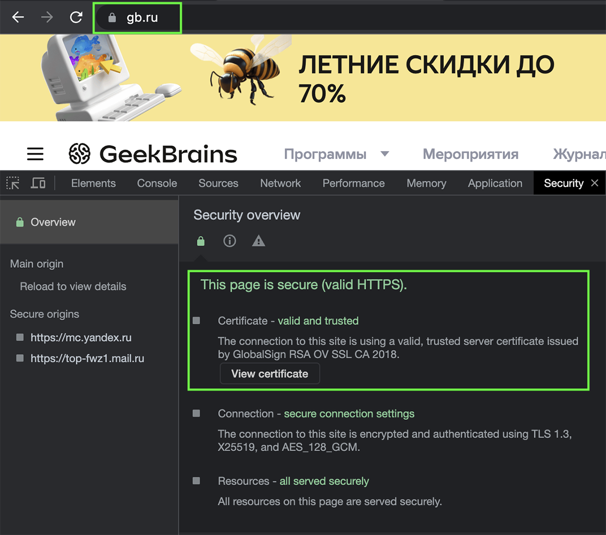
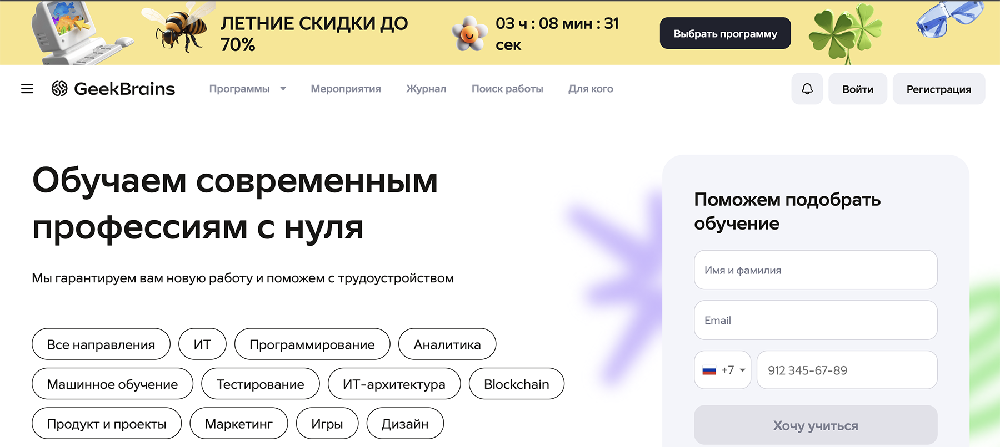
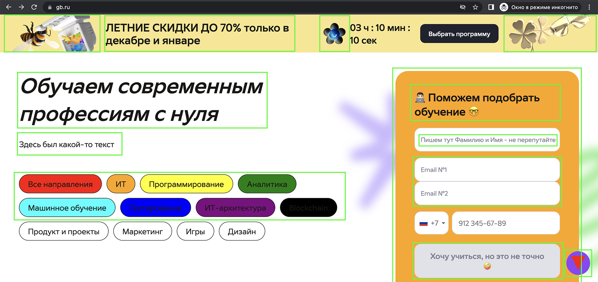
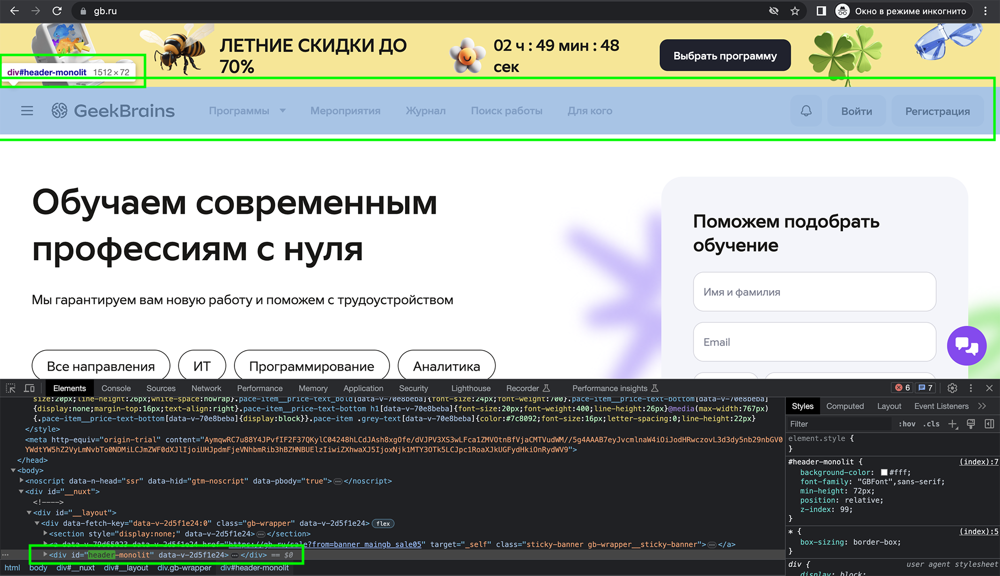
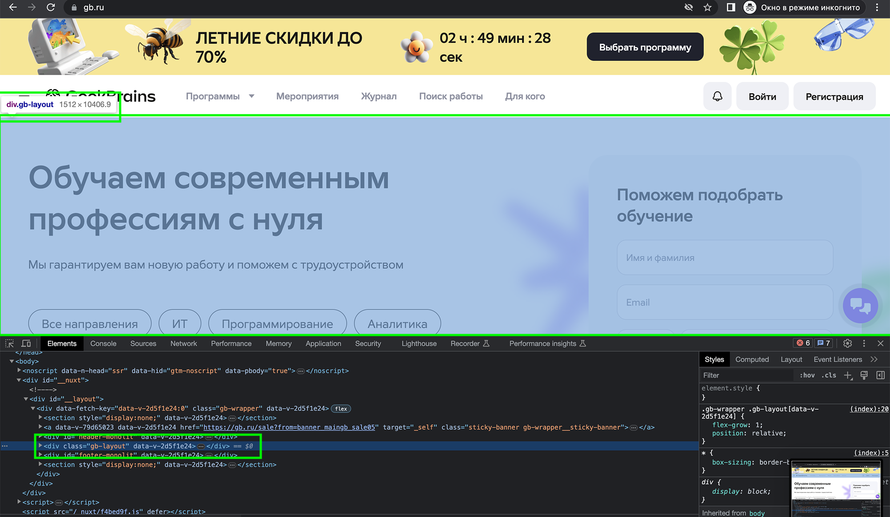
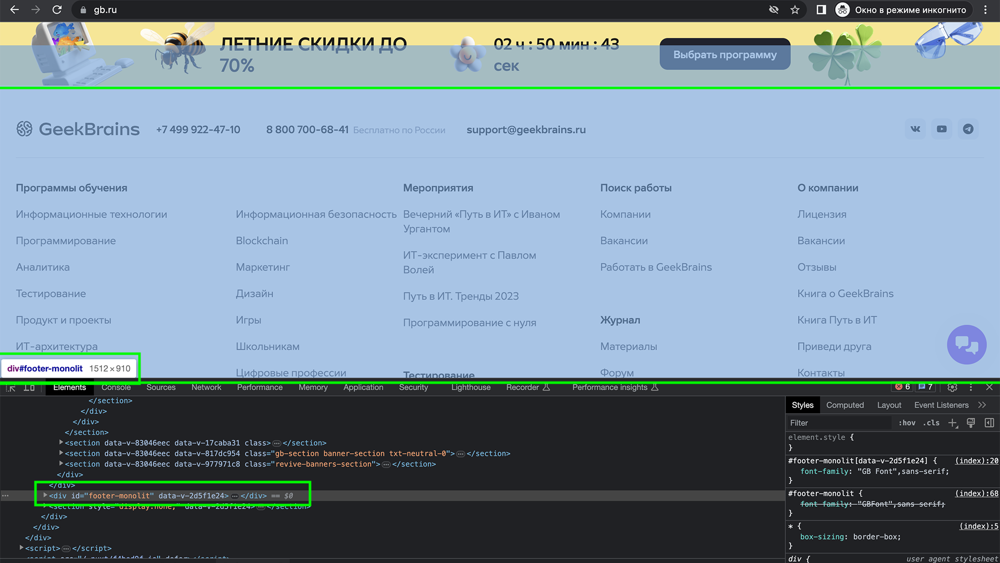
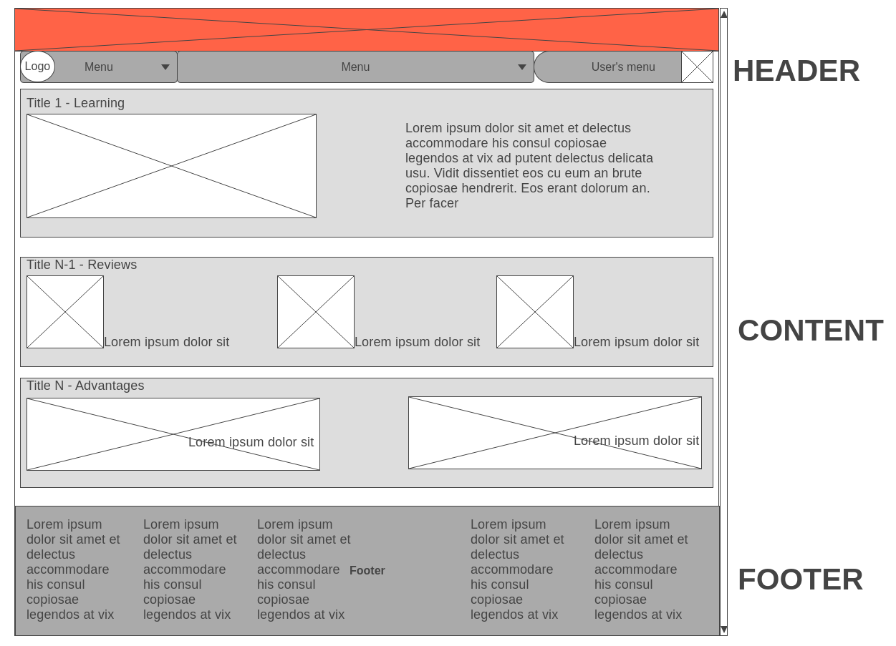

# Задача

_На основе сайта [dzen.ru](https://dzen.ru) **или** [gb.ru](https://gb.ru):_

1. Определите, на каком протоколе работает сайт.
2. Внесите не менее 7 изменений на страницу с помощью инструмента разработчика и представьте скриншоты было/стало.
3. Создайте прототип низкой детализации (на основе сайта dzen.ru или gb.ru).

# Решение

1. Определить, на каком протоколе работает сайт:

**GB - работает на протоколе https**

2.  GB - внести изменения на страницу с помощью инструмента разработчика:
    
**- До изменений**

    
**- После изменений**

3.  GB's header, footer и content
    
**- header**

    
**- content**

    
**- footer**

**- Прототип GB**

